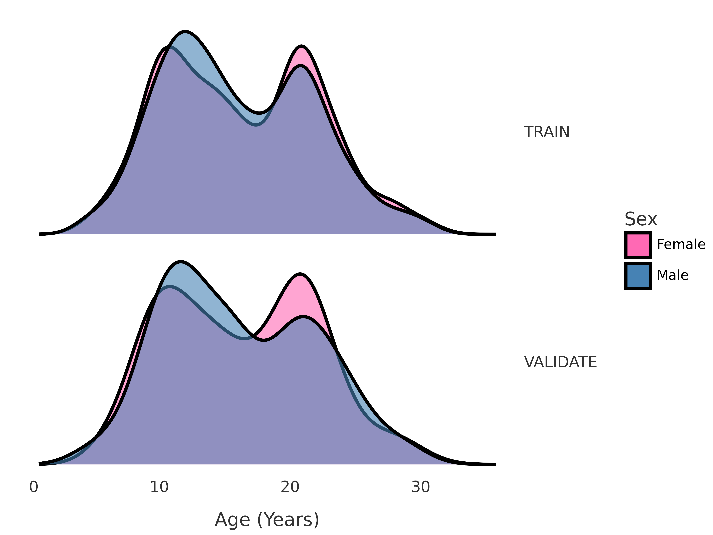
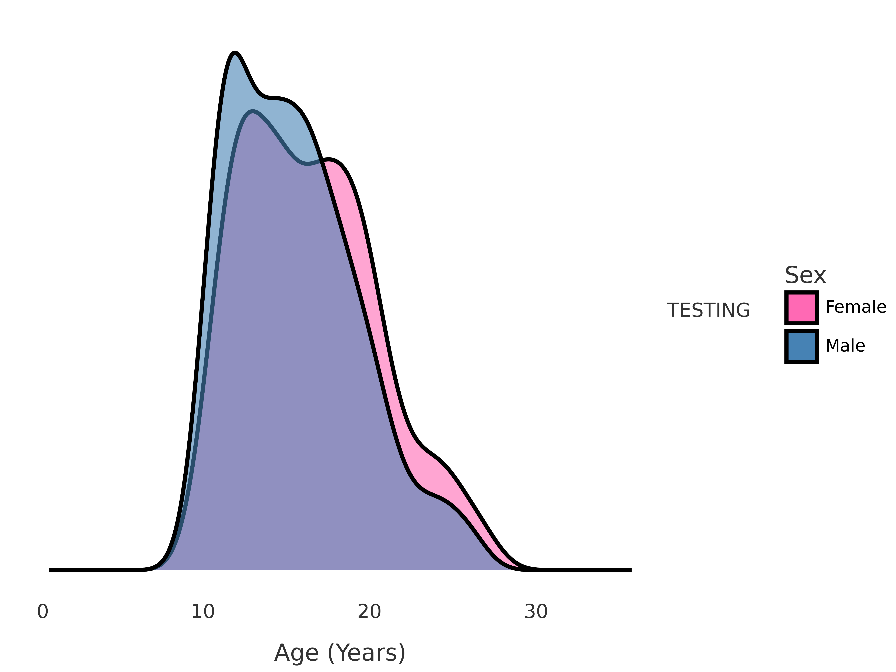
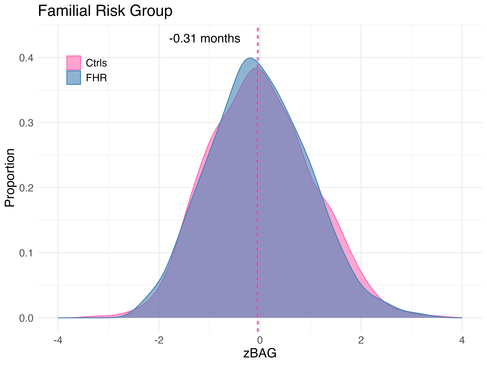
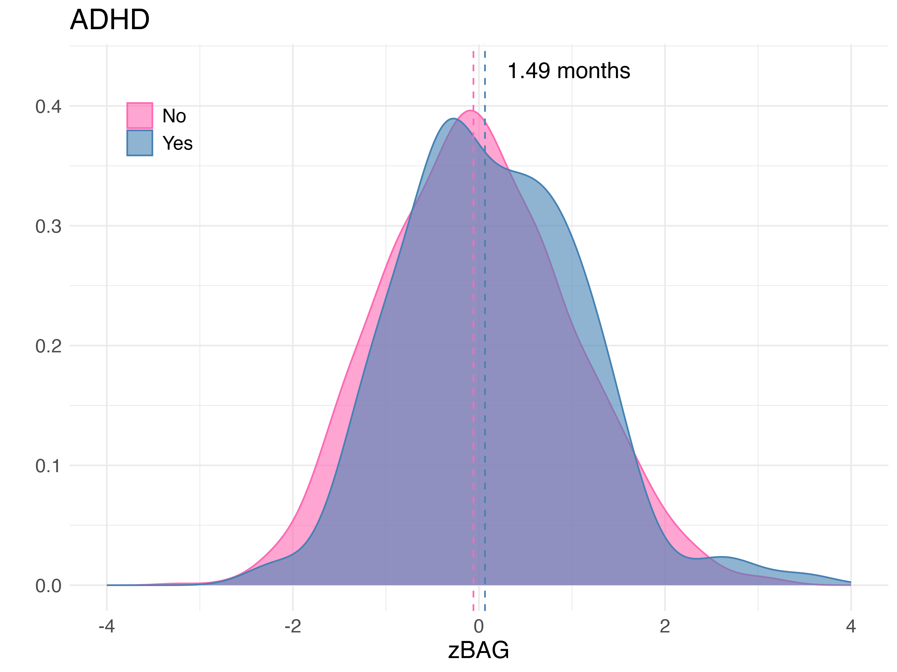
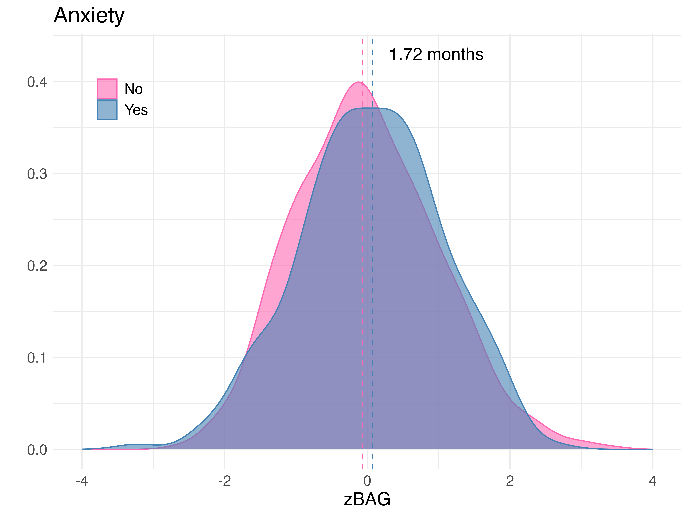
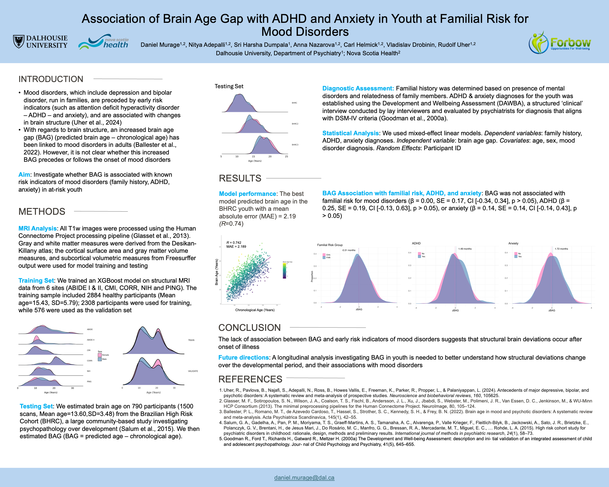
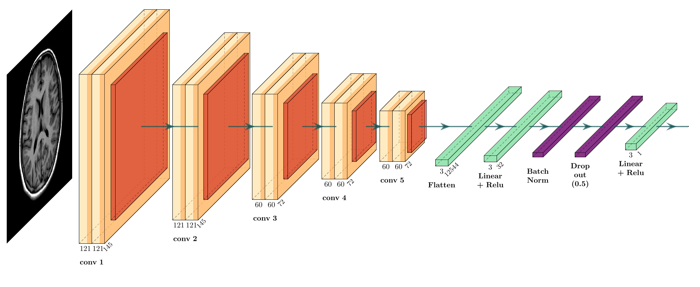

# 1. Install Packages

- Create a virtual environment and activate it
- Install required packages with:

    ```{python}
    pip install -r requirements.txt
    ```

## Distribution of Training Dataset

– Age distribution of the train and validation cohorts

<p float="left">
  
</p>

- XGBoost results on BHRC

## Forbow Distribution & brain age prediction
<p float="left">
  
   
</p>


## Familial Risk, ADHD, Anxiety
- Plots showing that there are no differences in brain age gap for participants with familial risk or developmental psychopathology (ADHD, anxiety)

<p float="left">
  
   
  
</p>


#### Results Presented at Society of Biological Psychiatry Conference in Toronto (April 2025)

<p float="left">
  
</p>


#### Brain Age CNN Architecture 

